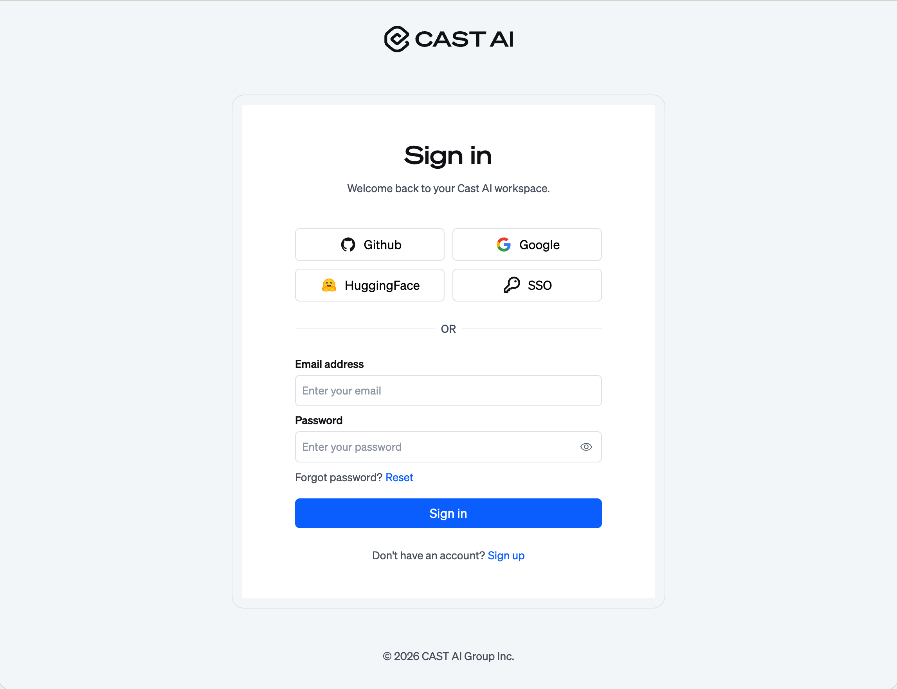
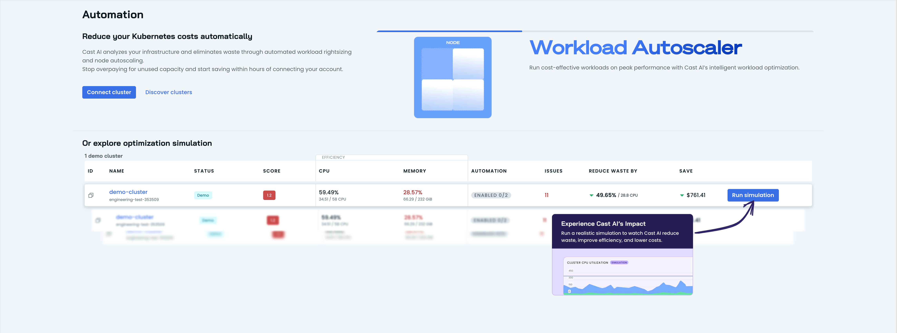

# Explore the CAST AI Console

Get familiar with the CAST AI platform by creating your account and exploring the demo cluster.

## Steps

1. **Open the CAST AI Console**

   Navigate to [https://console.cast.ai](https://console.cast.ai) in your browser.

   

2. **Create an account**

   If you do not already have a CAST AI account, click **Sign up** and register
   with your email address. Use the same email address you will use throughout
   this workshop, because we will be working with this account in later lessons.

3. **Validate your email**

   Check your inbox for a verification email from CAST AI and click the
   confirmation link. If you do not see it, check your spam or promotions folder.
   You must complete email validation before you can access the console.

4. **Sign in**

   Once your email is validated, return to [https://console.cast.ai](https://console.cast.ai)
   and sign in with your credentials.

5. **Explore the demo cluster environment**

   After signing in, you will land in the CAST AI console. Take a few minutes to
   look around. Open the **Clusters** section and click into the demo cluster to
   review:
   - Cluster overview and node list
   - Workloads running in the cluster
   - Cost overview and savings opportunities
   - Policies and autoscaling settings

   

   This is a read-only exploration — you do not need to make any changes yet.

6. **Proceed to the next lesson**

   Once you can sign in to the console and view the demo cluster, you are ready
   to continue.
