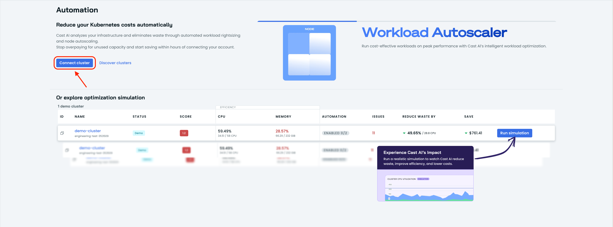
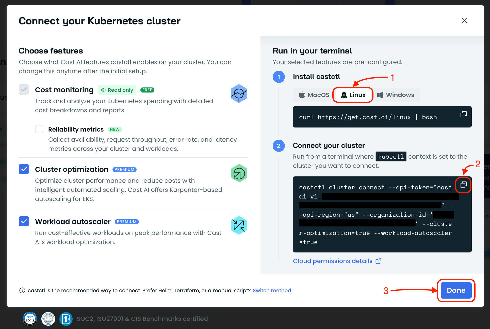
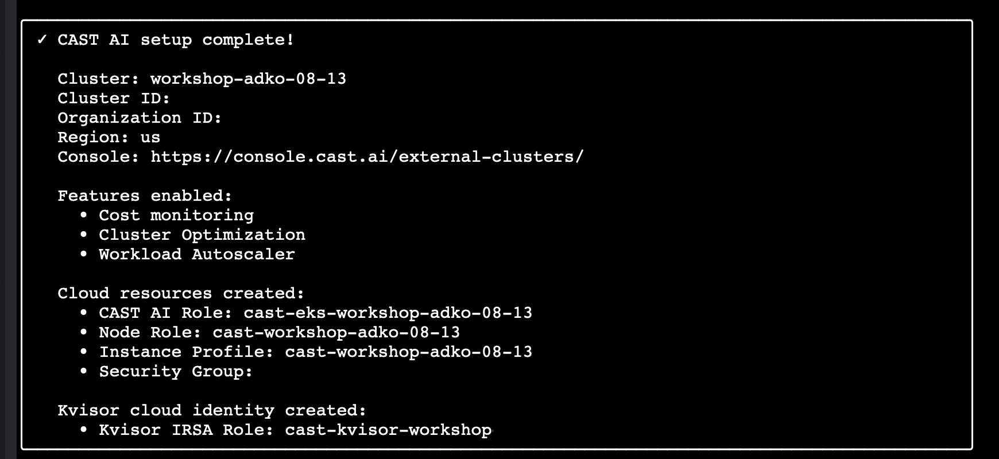
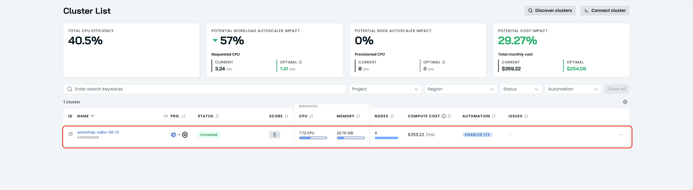

# Connect Your Cluster

Connect your Kubernetes cluster to CAST AI through the console.

## Steps

1. **Open the CAST AI Console**

   Navigate to <a href="https://console.cast.ai" target="_blank" rel="noopener noreferrer">https://console.cast.ai</a> and sign in
   with the account you created earlier.

2. **Start the cluster connection flow**

   From the console, click the **Connect cluster** button.

   

3. **Copy the connection script**

   In the connection dialog, switch to the **Linux** tab and copy the provided
   shell script.

   

4. **Run the script in your terminal**

   Make sure your terminal has the correct Kubernetes context set for the
   cluster you want to connect. Paste and run the script you copied from the
   console.

5. **Accept the default installation options**

   The installer will ask how you prefer to install the CAST AI agent. For
   simplicity, accept the default options at each prompt.

6. **Review the installation summary**

   Once the installation finishes, the script prints a summary of everything
   that was installed in your cluster. Read through it to confirm the CAST AI
   agent and related components are in place.

   

7. **Confirm the cluster is connected**

   Return to <a href="https://console.cast.ai" target="_blank" rel="noopener noreferrer">https://console.cast.ai</a>. Your cluster
   should appear in the connected state and be ready for the next lessons.

   
