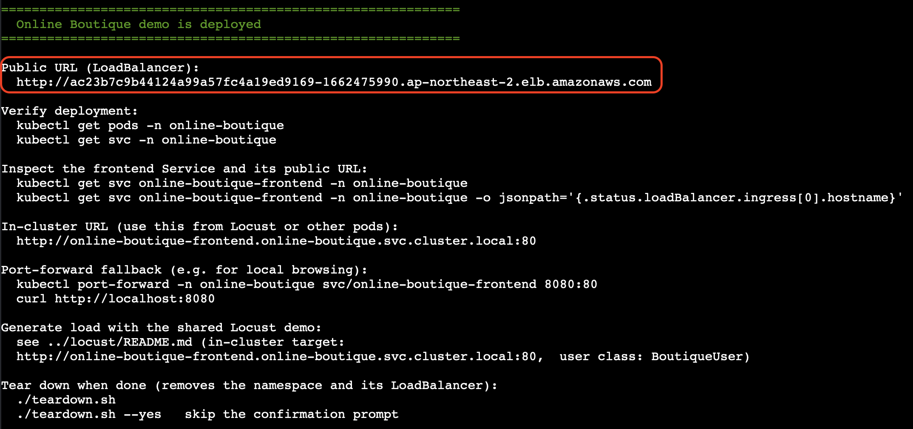
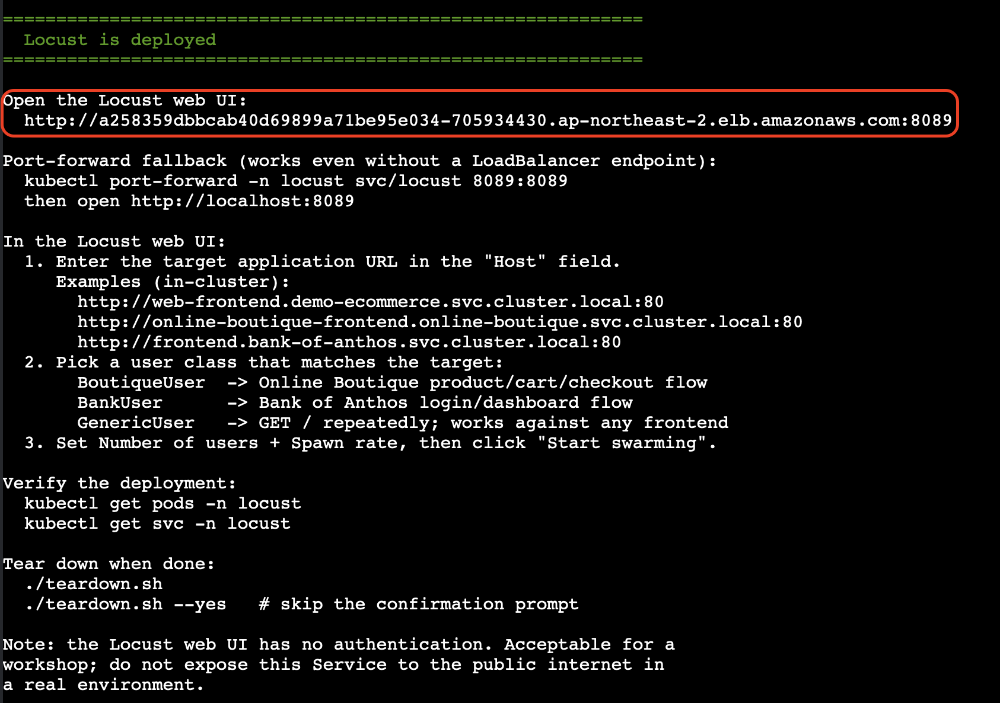
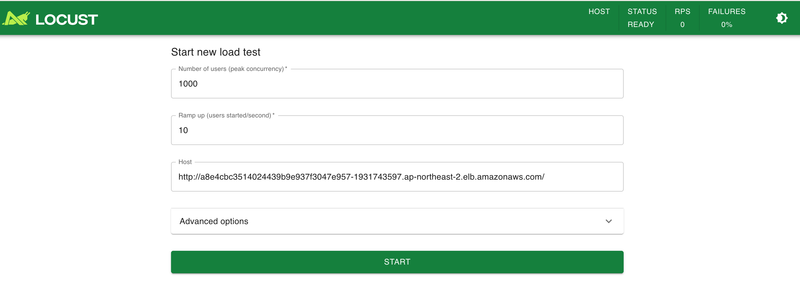
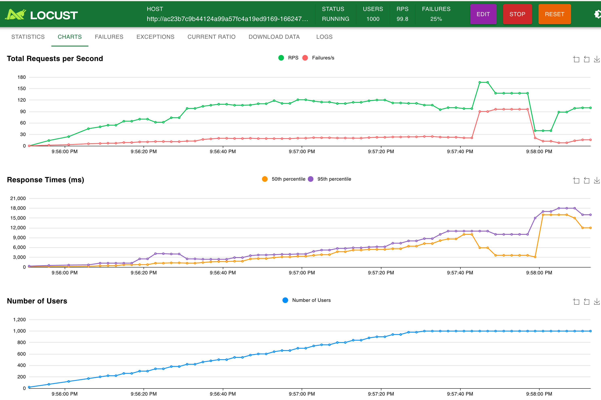

# Deploy the demo application

Prepare the workshop environment by deploying the demo application and
simulating production load.

## Steps

1. **Deploy the demo application**

   Run the Online Boutique deployment script. This deploys a sample commerce
   application that will act as the workload we optimize in this lesson.

   ```bash
   ./demos/online-boutique/deploy.sh
   ```

2. **Open the application in your browser**



Once the deployment finishes, copy the LoadBalancer URL printed by the
script and open it in any browser. You should see the Online Boutique
storefront.


3. **Deploy the load generator**

   Start the Locust load generator so the application has realistic traffic
   while you work through the lesson.

   ```bash
   ./demos/locust/deploy.sh
   ```

4. **Open the load generator UI**

   

   Copy the new LoadBalancer URL from the Locust deployment output and open it
   in a second browser tab.

5. **Explore the load generator settings**

   In the Locust UI, take a moment to review the available options. Adjust the
   number of users and spawn rate to simulate thousands of concurrent shoppers
   hitting the storefront.

   

   Paste your boutique application load balancer URL, and start simulating user load.
   Switch to graphs view and see latency rise. Go and try to navigate boutique app yourself, you will notice the difference.

   

6. **Proceed to the next section**

   Once the application is serving traffic and the load generator is running,
   continue with enabling VPA for the workloads.
