# Enable VPA

The Online Boutique application is receiving a huge volume of user requests,
and performance is degrading. In this lesson you will use CAST AI's workload
autoscaler to configure Vertical Pod Autoscaling (VPA) and right-size the
workloads.

## Steps

1. **Open your onboarded cluster**

   In the CAST AI console, navigate to your connected cluster.

2. **Open Workload Autoscaler**

   Go to the **Workload Autoscaler** section.

3. **Explore the Optimization screen**

   In the **Optimization** screen, filter the table by the `online-boutique`
   namespace. You will see all services that make up the Online Boutique
   application. Explore the list to identify which services are starving for
   resources.

   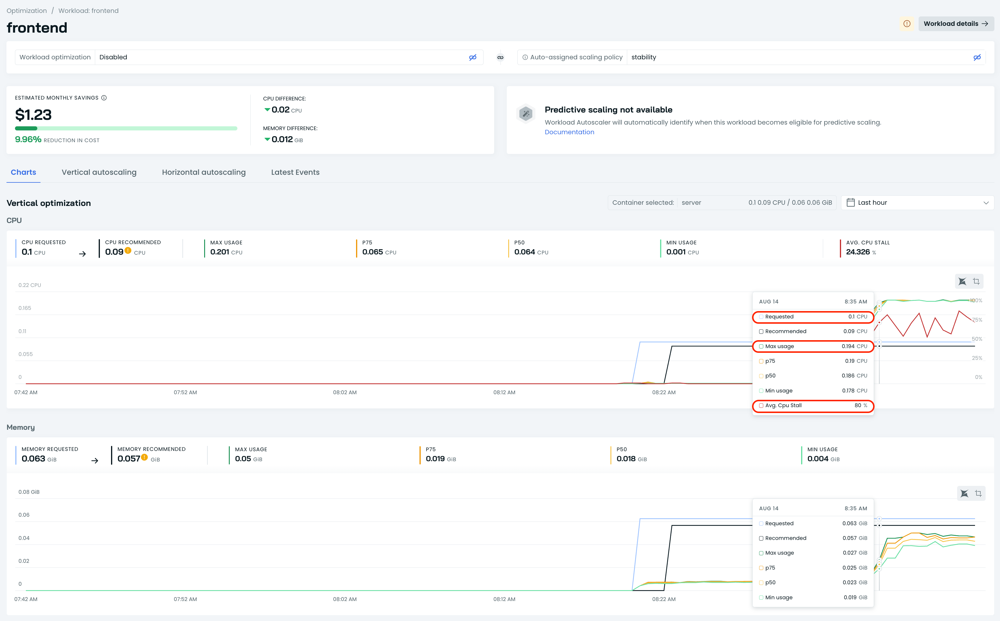

4. **Open Scaling Policies**

   Navigate to **Scaling Policies**. You will see that CAST AI has already
   created predefined policies and assigned workloads to the most suitable one
   based on profiling.

   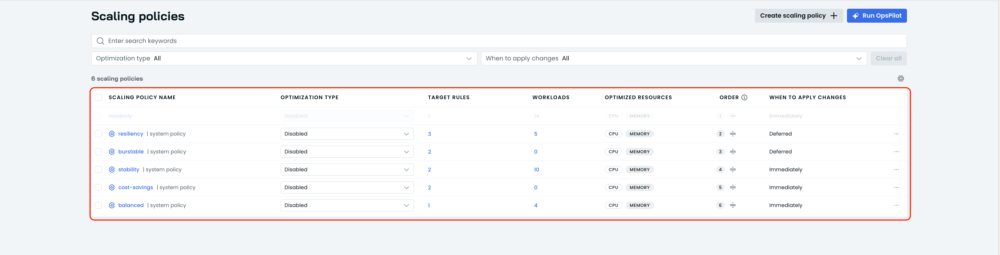

5. **Create a new scaling policy**

   Click **Create scaling policy**.

   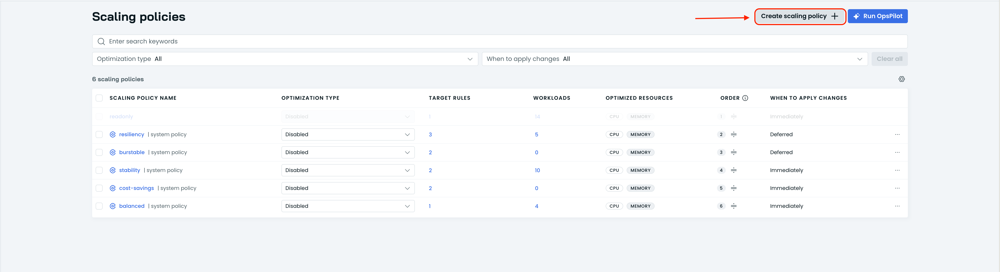

6. **Configure the policy**

   On the **Create scaling policy** page, use the following settings:
   - **Policy name:** `Zero-confidence`
   - **Optimization type:** `Vertical`

   Then switch to the **Vertical rightsizing** tab and configure these four
   options:
   - **When to apply changes:** `Zero-downtime updates`

     We are optimizing an ecommerce application. Even if some services only
     have one replica, we do not want to introduce downtime.

     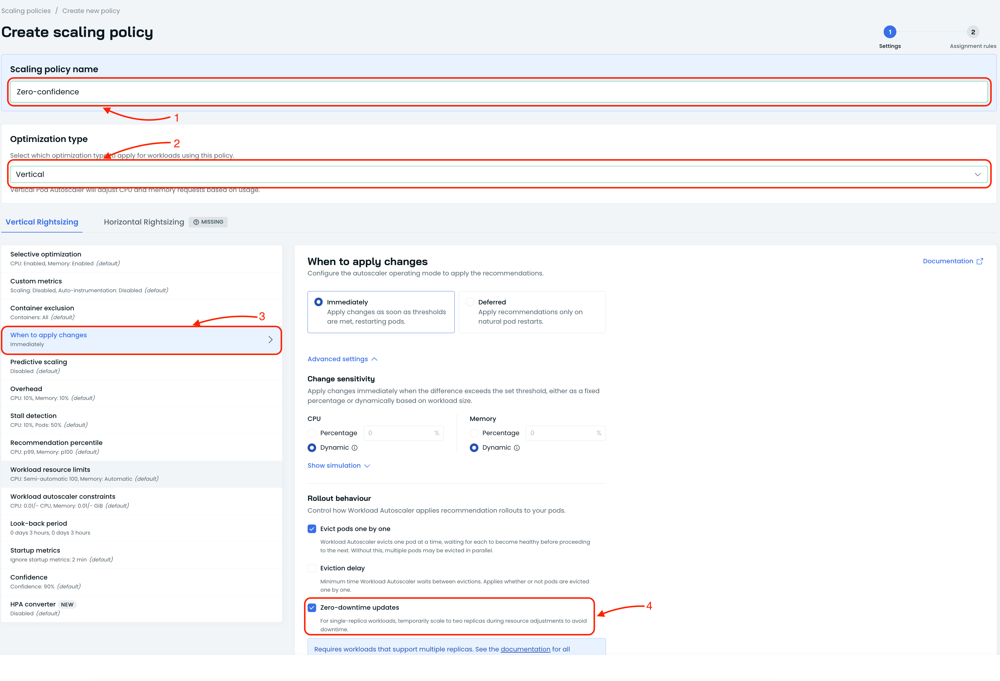

   - **Stall detection:** `5%`

     The application has become slow because user requests are waiting in queue
     for CPU cycles. Stall detection captures this behavior.

     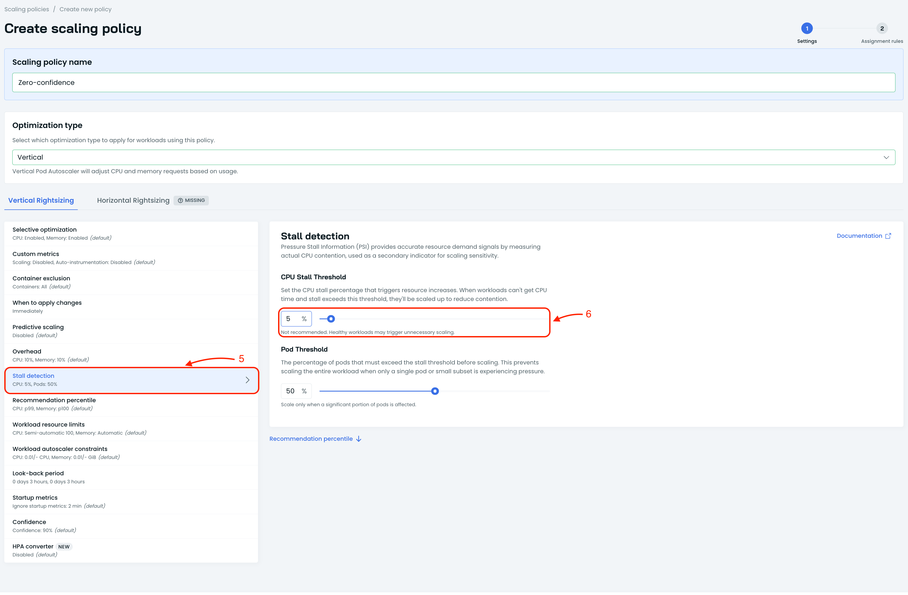

   - **Look-back period:** `3 hours`

     For the workshop we want to see changes quickly, so use the shortest
     look-back period. The engine will use the last 3 hours of data when
     calculating recommendations.

     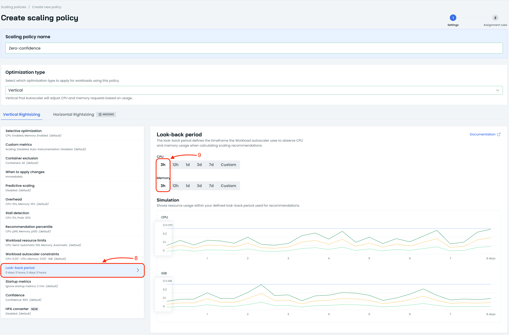

   - **Confidence:** `5%`

     This tells the engine to apply recommendations even with very little
     historical data. Only reduce confidence for demo purposes on
     non-production clusters.

     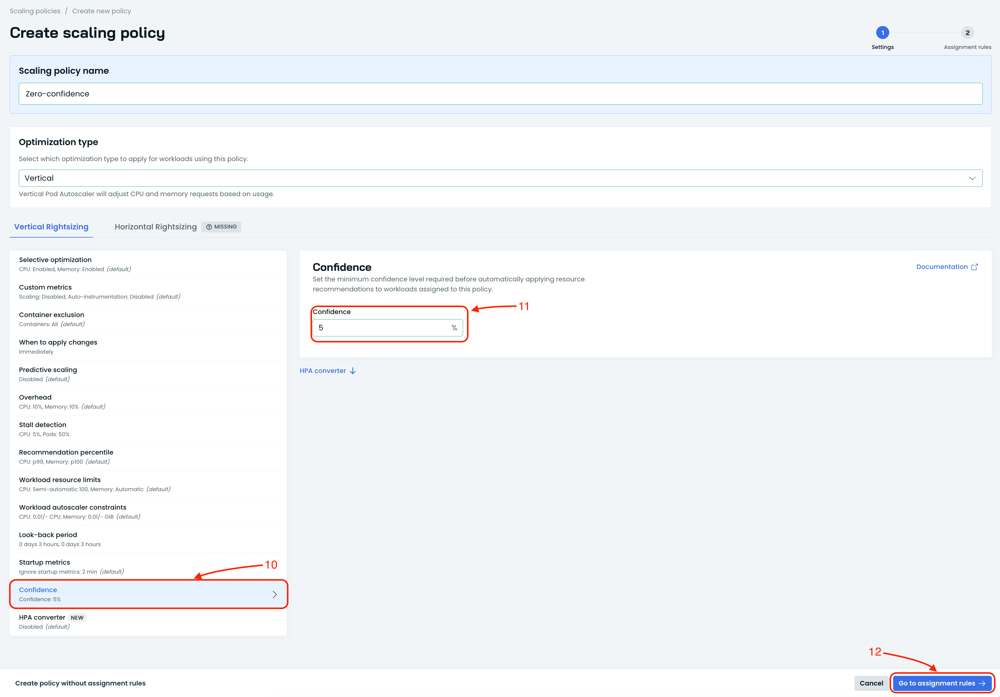

7. **Create assignment rules**

   Click **Go to assignment rules**, then click **Add rule**.

   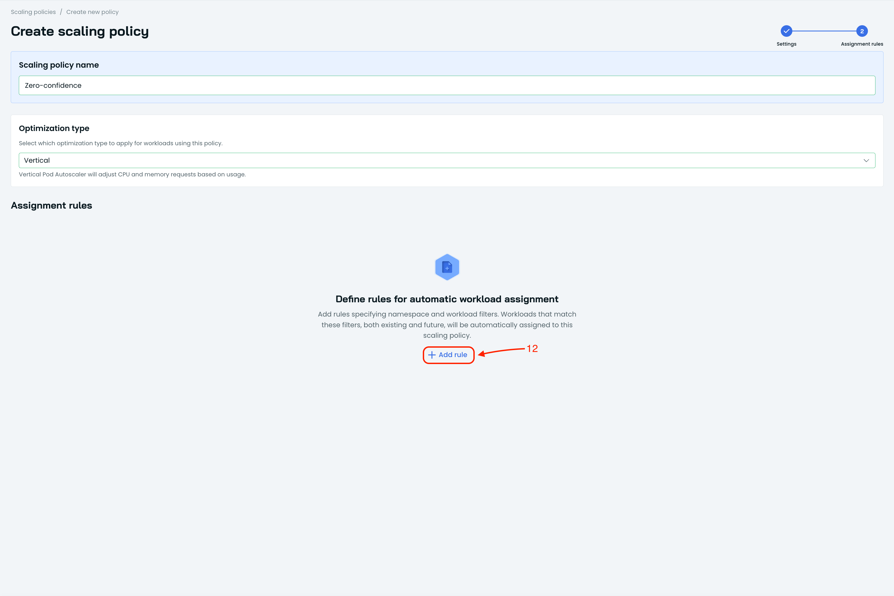

   Choose the
   `online-boutique` namespace — the entire application runs there — and click
   **Create**.

   

8. **Reorder the policy**

   Return to the **Scaling Policies** table. The new `Zero-confidence` policy
   shows `0` workloads assigned because policy order matters. Move the `Zero-confidence` policy to the top of the table and click **Save**.

   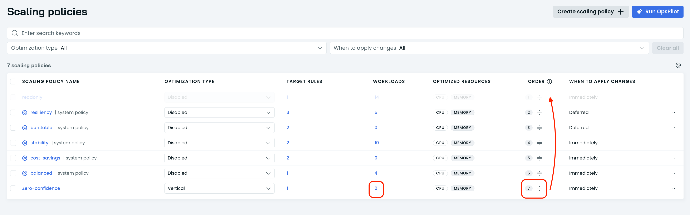

9. **Confirm workload assignment**

   Refresh the page. You should now see that `11` workloads are assigned to the
   `Zero-confidence` policy.

   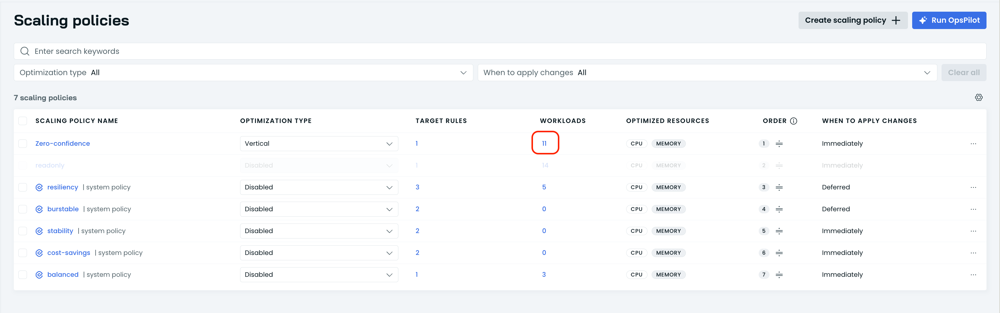

10. **Verify the improvement**

    Switch back to the Locust load generator UI. Watch the total requests per
    second increase and the response times decrease as the application is
    right-sized to serve 1000 concurrent users.

    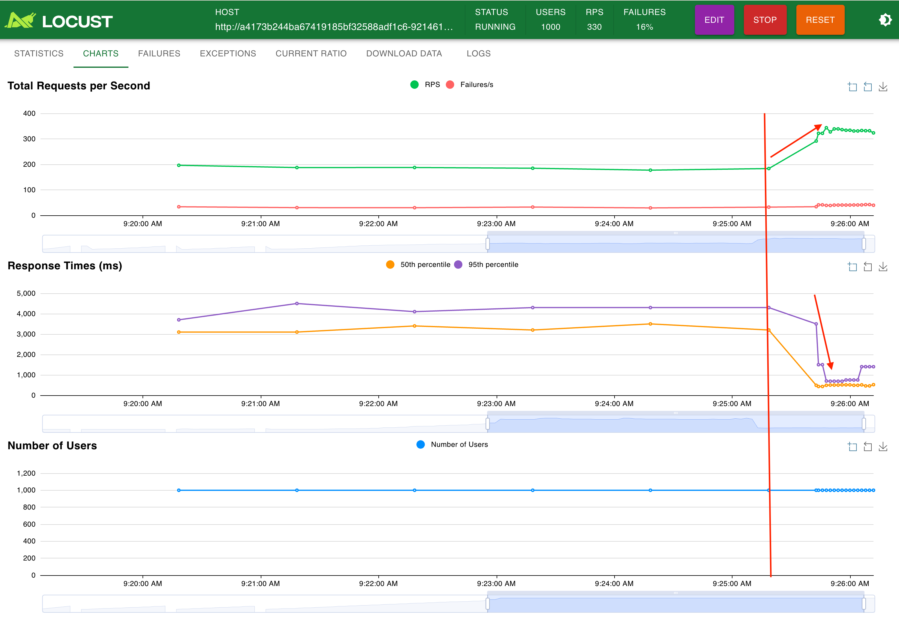

    Check CAST AI console, to see that average CPU stall metric has also went down.

    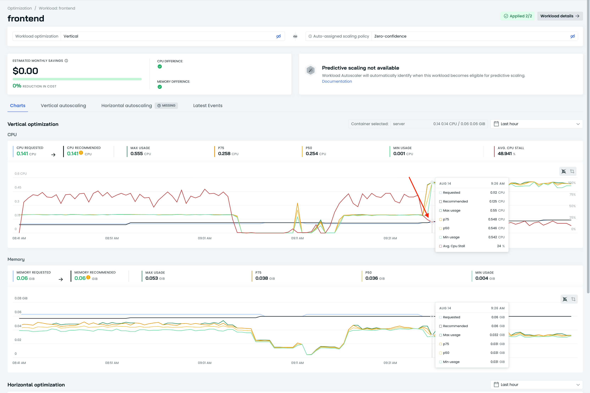

11. **Proceed to the next lesson**

    Once you see improved throughput and lower response times in Locust, the
    VPA optimization is complete. Continue to the next optimization.
