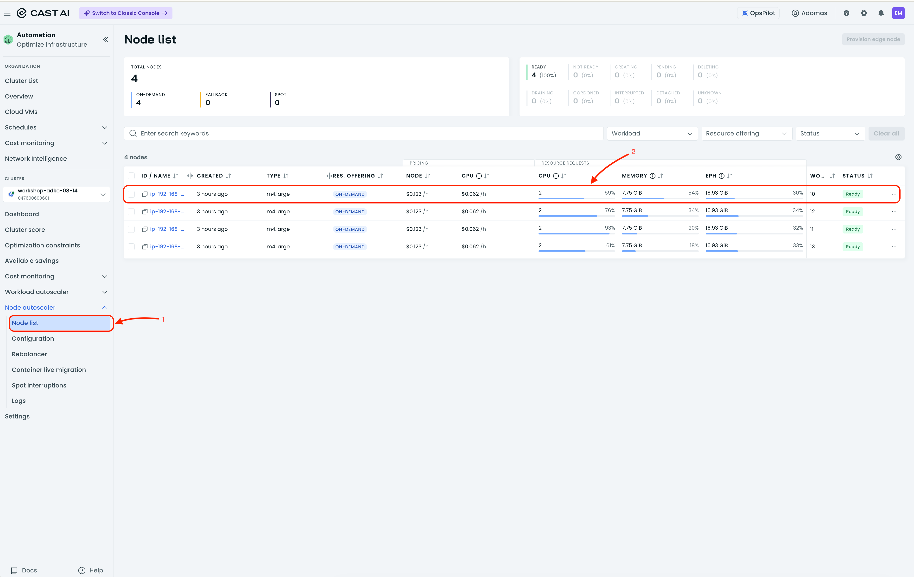
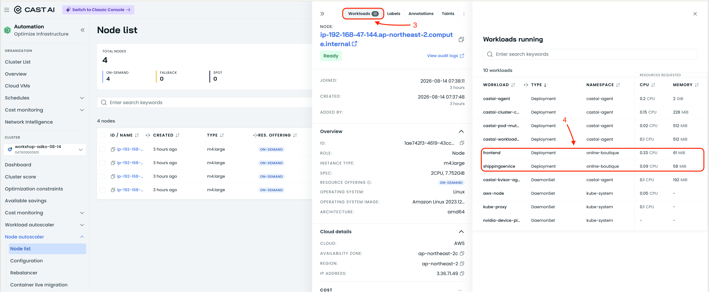
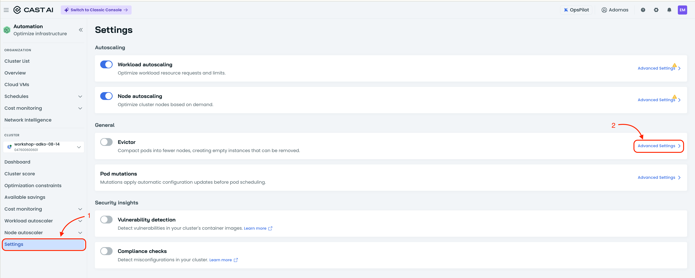
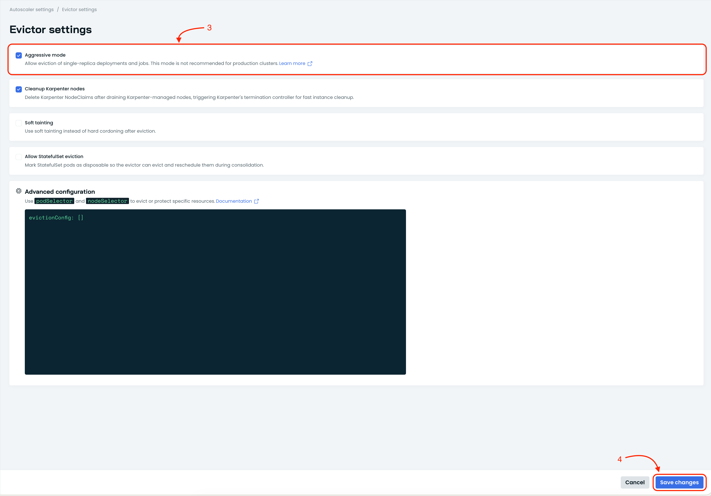
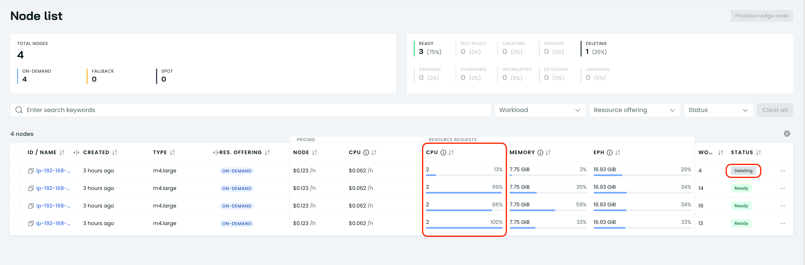
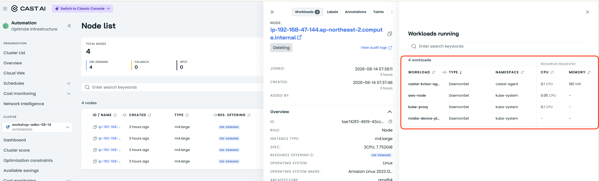

# Enable Bin Packing

Now that the application is requesting the resources it actually needs and
waste is minimized, the next goal is to fight the default Kubernetes scheduler
behavior. Kubernetes spreads workloads evenly across available nodes, but to
achieve the highest possible savings we want the opposite: pack nodes as densely
as possible.

CAST AI solves this with the **Evictor** component. Evictor analyzes nodes and
the workloads running on them, then redistributes workloads within the existing
nodes. Over time this makes some nodes empty, allowing CAST AI to remove them
and reduce infrastructure cost.

## Steps

1. **Observe current workload distribution**

   Open the node list in the CAST AI console and look at where the
   `online-boutique` workloads are running. You will notice that Kubernetes has
   spread the services across all available nodes. This even distribution is the
   default scheduler behavior we want to change.

   
   

2. **Go to the Evictor settings**

   Find the **Evictor** component in the cluster settings or optimization
   section.

   

3. **Enable Evictor in aggressive mode**

   Turn on Evictor and set it to **aggressive mode**. The Online Boutique
   application includes services that run with only a single replica. In the
   default mode Evictor will not move such workloads to avoid potential service
   disruptions, which prevents effective bin packing. Aggressive mode allows
   Evictor to rebalance these workloads as well, so nodes can be packed more
   densely.

   

4. **Wait for rebalancing**

   Evictor will begin redistributing workloads to pack nodes more densely. This
   process is gradual and respects workload disruption budgets. You can watch
   the node count and workload distribution change over time in the console.

5. **Verify node consolidation**

   Return to the cluster view after a few minutes. You should see that some
   nodes have become empty and are being removed, while the remaining nodes run
   a higher density of workloads.

   **Note:** Node is being removed by CAST AI autoscaler, which is removing empty nodes by default.

   
   

6. **Proceed to the next lesson**

   Once Evictor has consolidated workloads and reduced the node count, lets configure node autoscaler in another lesson.
