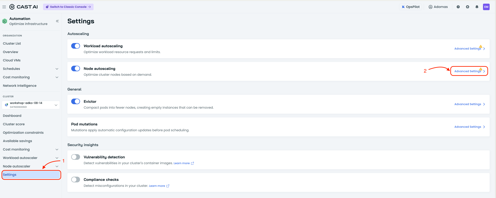
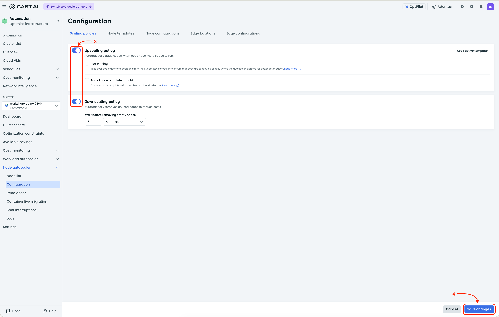
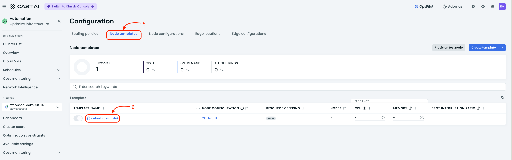
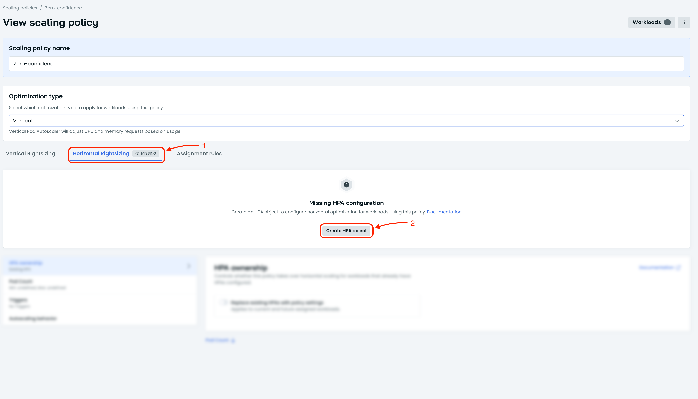
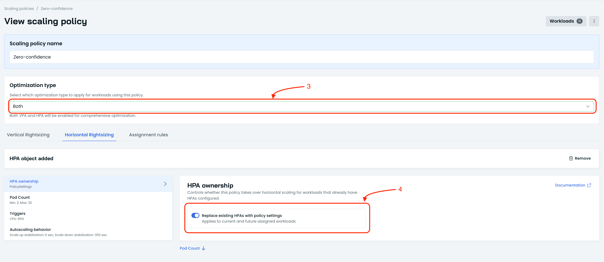
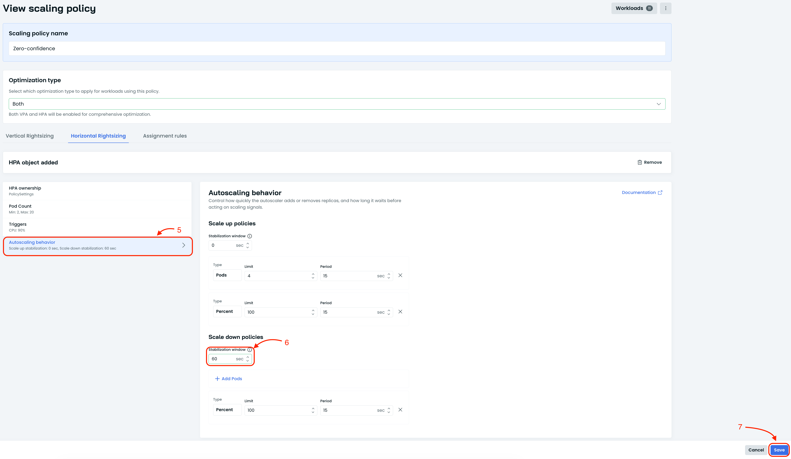
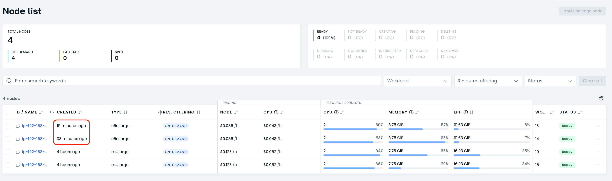

# Enable Node Autoscaler

The cluster is now optimized and can serve 1000 concurrent users. But what
happens if concurrent user growth continues? We cannot serve new users unless we
scale out the services, and to scale services we first need to scale cluster
capacity. In this lesson you will enable the CAST AI Node Autoscaler and
configure node templates so the cluster can grow and shrink automatically.

## Steps

1. **Enable Node Autoscaler policies**

   In the CAST AI console, go to **Settings** and open the **Advanced settings**
   of the Node Autoscaler.

   

   Enable both upscaling and downscaling policies, then click **Save**.

   

   CAST AI will now upscale the cluster when it detects unscheduled pods, and
   downscale when it detects empty nodes — the same empty nodes Evictor is
   constantly trying to create.

2. **Edit the default node template**

   Go to **Node templates** and edit the default node template. This tells CAST
   AI what kind of nodes your application can run on.

   

3. **Configure resource offering**

   Select **Resource offering** and include **on-demand** nodes in addition to
   any other options.

4. **Set processor architecture**

   Change the processor architecture to **x86_64**. The demo application does
   not support ARM64.

5. **Add machine constraints**

   The Online Boutique application is CPU intensive, so choose **compute
   optimized** machines to minimize memory waste. Also make sure to exclude
   **burstable** instances, because consistent performance is required.

6. **Set a CPU limit**

   To prevent the cluster from scaling indefinitely, set a **CPU limit of 48**
   vCPUs. This keeps the demo within budget while still allowing room to grow.

7. **Save the node template**

   Click **Save** to apply the template changes.

   
   

8. **Configure Horizontal Pod Autoscaling**

   VPA is designed for long-term resource optimization, but it cannot react fast
   enough to sudden traffic spikes. For short-term spikes we need Horizontal Pod
   Autoscaling (HPA), which adds more pod replicas when demand increases.

   Go back to the `Zero-confidence` workload scaling policy and enable
   horizontal scaling. This allows CAST AI to scale out the Online Boutique
   services by adding replicas when the load suddenly increases.

   
   
   

9. **Simulate a sudden traffic spike**

   Go to the Locust load generator and change the test configuration to:
   - **Number of users:** `5000`
   - **Spawn rate:** `100`

   Start the test. This simulates a sudden spike to 5000 concurrent users,
   with new users added at a rate of 100 per second.

10. **Watch the platform react**

    As the spike hits, observe how HPA adds replicas, the Node Autoscaler adds
    nodes when unscheduled pods appear, and the existing VPA and Evictor
    optimizations keep the cluster efficient.

    

11. **Proceed to the next lesson**

    Once you see the cluster scaling out under the sudden load, continue to the
    next optimization.
