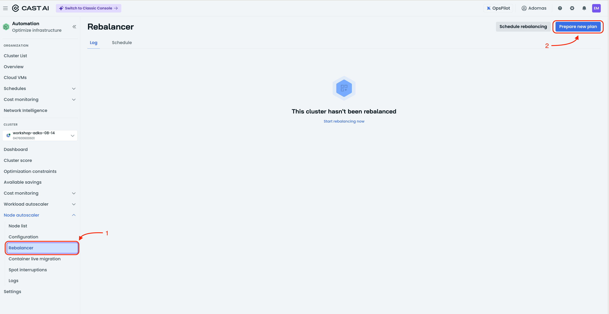
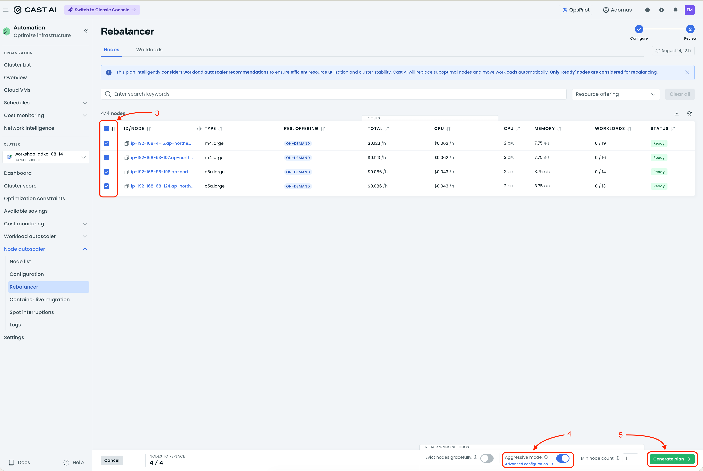
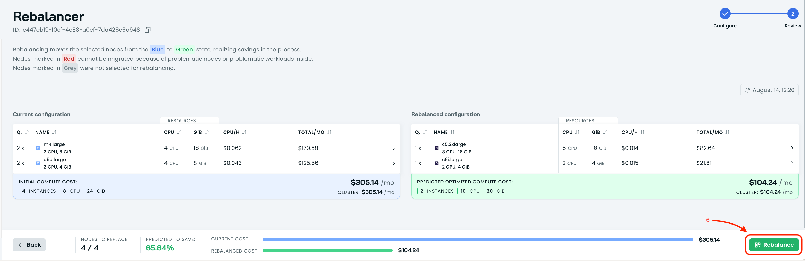
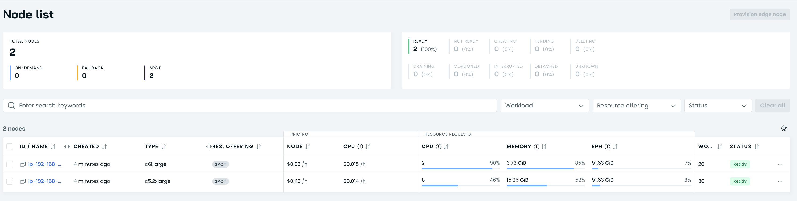

# Rebalance the Cluster

CAST AI products work in synergy. HPA increases replica count, VPA adjusts
resources based on usage, Evictor packs workloads densely onto nodes, and the
Node Autoscaler adds the most suitable nodes for the current situation.

But if you zoom out, a problem appears: slowly growing service load forces the
autoscaler to add small nodes one at a time. This can leave the cluster with
four or five different small nodes that are not the most cost-efficient
configuration. CAST AI solves this with **cluster rebalancing**.

## Steps

1. **Open the Rebalancer**

   In the CAST AI console, navigate to the **Rebalancer** section for your
   cluster.

   

2. **Generate a new rebalancing plan**

   Click to generate a new plan. CAST AI will analyze the current cluster and
   propose an optimized configuration. It will show:
   - The current node layout
   - The proposed new node layout
   - Potential savings from the rebalance

3. **Run a full rebalance**

   You can choose to rebalance the full cluster or only a subset of nodes. For
   this workshop, select **Full rebalance**.

   

4. **Execute the plan**

   Review the proposed plan and click **Execute**. CAST AI will migrate
   workloads onto the optimized set of nodes.

   

5. **Check the node list**

   Once the rebalance finishes, open the node list and compare it to the
   previous configuration. You should see a smaller, more cost-efficient set of
   nodes running the same workloads.

   

6. **Proceed to the next lesson**

   After confirming the cluster has been rebalanced, continue to the next
   optimization.
