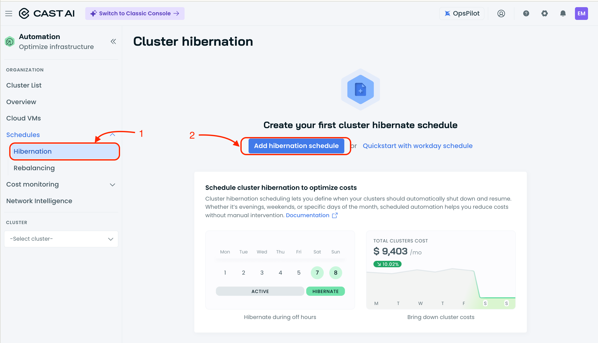
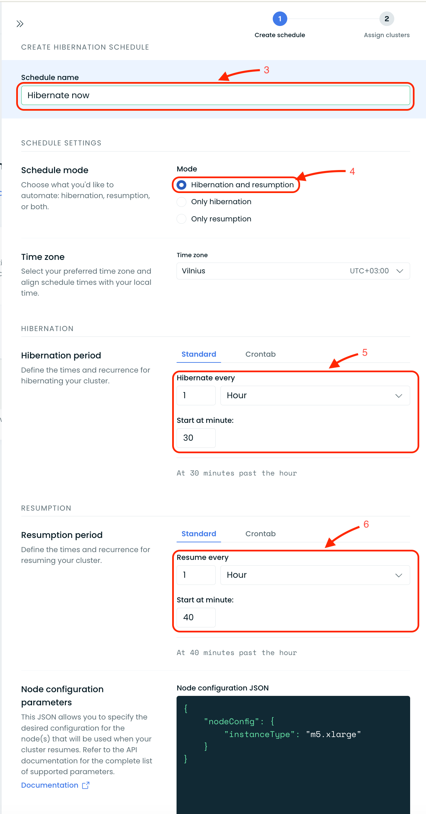
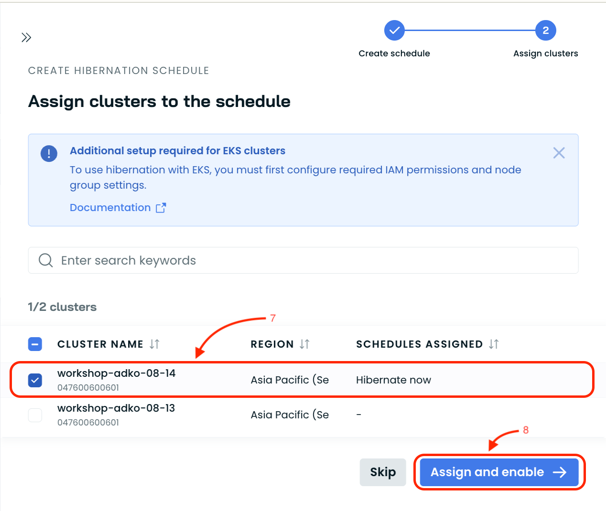
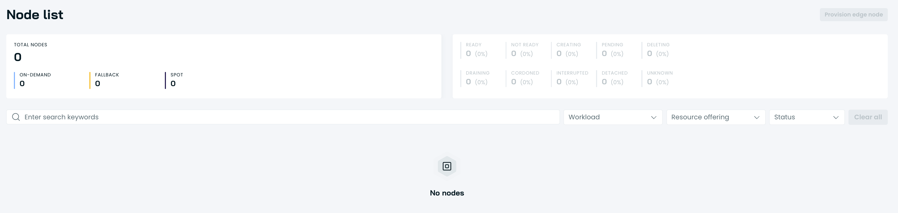
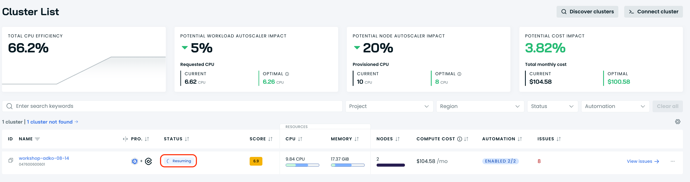
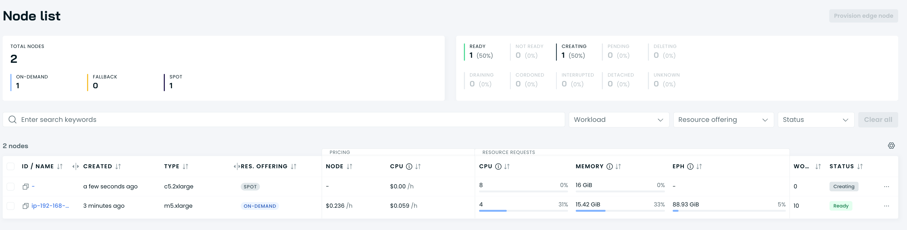

# Hibernation

The cluster is now optimized and rebalanced. One last CAST AI feature worth
showcasing is **cluster hibernation**. Large organizations run CI/CD or
development clusters that are only needed during business hours. Hibernating
those clusters overnight or over weekends can significantly reduce cost, and
CAST AI makes the process painless.

## Steps

1. **Open Schedules**

   In the CAST AI console, navigate to the **Schedules** section.

   

2. **Create a hibernation schedule**

   Create a new schedule for your cluster and configure it to:
   - **Hibernate** the cluster in the next 5 minutes
   - **Resume** the cluster 5 to 10 minutes after hibernation starts

   

3. **Assign the cluster**

   Assign your connected cluster to the schedule you just created.

   

4. **Wait for hibernation**

   Watch the console. After about 5 minutes CAST AI will hibernate the cluster,
   scaling all workloads down to zero and removing nodes.

   
   

5. **Wait for wake-up**

   After another 5 to 10 minutes, the schedule will trigger a resume. CAST AI
   will bring the cluster back online.

   
   

6. **Verify the cluster is running**

   Once the cluster has resumed, check that nodes are back and workloads are
   running as expected.

7. **Proceed to the next lesson**

   After confirming hibernation and resume both work, continue to the closing
   section.
